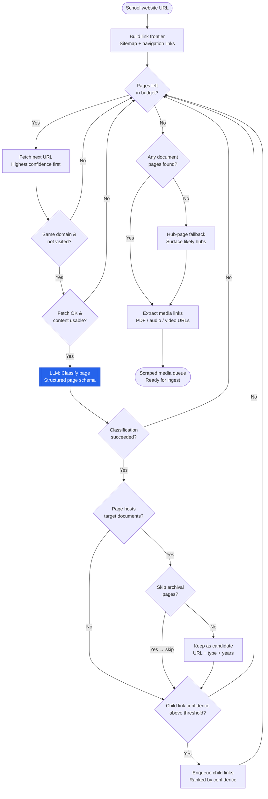
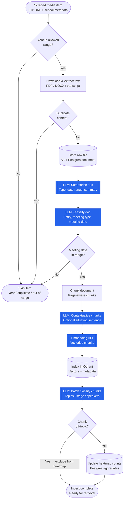
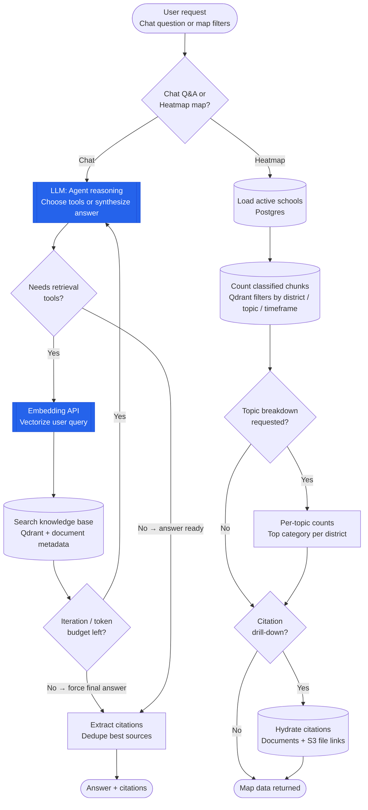

# Just EdTech — Data Flow Overview

**Purpose:** High-level overview of how school website content is discovered, ingested into the knowledge base, and retrieved for chat and the district heatmap.

**Legend**
- **Rectangle** = process step
- **Diamond** = decision gate
- **Double-bordered box** = LLM or Embedding API call
- **Cylinder-style step** = data store read/write

---

## End-to-End Handoff

```
School URL
  → Schema crawler (LLM page classify)
  → Candidate archive pages
  → Media link extraction (PDF / audio / video)
  → Ingest (summarize → classify → chunk → embed → batch-tag)
  → S3 + Postgres + Qdrant
  → Chat agent OR Heatmap engine
```

---

## 1. Schema-Based Scraping

Discover meeting-document pages on a school website, then extract media file links. Uses a **schema-driven crawler only** — the LLM classifies each page and ranks which links to follow next. Does **not** include keyword/manual URL discovery.

### Flow diagram



### Decision gates

| Gate | Yes path | No path |
|------|----------|---------|
| Pages left in budget? | Continue crawl | Exit loop → check results |
| Same domain & not visited? | Fetch page | Skip URL |
| Fetch OK & content usable? | Classify with LLM | Skip page |
| Classification succeeded? | Evaluate page content | Skip page |
| Page hosts target documents? | Check archival rule | Enqueue links only |
| Skip archival pages? | Do not add to candidates | Add URL as candidate |
| Child link confidence above threshold? | Add to frontier | Do not enqueue |
| Any document pages found? | Extract media | Use hub-page fallback |

### LLM API calls

| Step | Purpose |
|------|---------|
| **Page classifier** (per visited page) | Is this a document/archive page? Which child links look relevant, and at what confidence? |

### Data stores

| Store | When used |
|-------|-----------|
| In-memory | Crawl state during discovery |
| Postgres (ScrapedMedia) | After media link extraction |

---

## 2. Document Ingest

Turn scraped meeting files into searchable, taxonomy-tagged chunks for chat and the district heatmap.

### Flow diagram



### Decision gates

| Gate | Yes path | No path |
|------|----------|---------|
| Year in allowed range? | Download file | Skip item |
| Duplicate content? | Skip item | Continue ingest |
| Meeting date in range? | Chunk & index | Skip remaining pipeline |
| Chunk off-topic? | Exclude from heatmap counts | Include in heatmap aggregates |

### LLM API calls

| Step | Purpose |
|------|---------|
| **Document summarizer** | Document type, date range, summary paragraph |
| **Document classifier** | Entity type, doc kind, meeting date, meeting body |
| **Chunk contextualizer** (optional) | 1–2 sentence situating context per chunk |
| **Embedding API** | Vector representations for semantic search |
| **Batch chunk classifier** | Topics, topic tags, action stage, speakers, off-topic flag |
| **Image caption** (optional) | Vision model for embedded PDF images |

### Data stores

| Store | What is stored |
|-------|----------------|
| **S3** | Raw media files, transcripts |
| **Postgres** | Documents, processing jobs, pending classifications, heatmap aggregates |
| **Qdrant** | Chunk vectors + taxonomy/metadata payload |

---

## 3. Retrieval

Two read paths over the same indexed corpus: **conversational Q&A** (Agentic RAG) and **district heatmap** counts with citations.

### Flow diagram



### Decision gates — Chat path

| Gate | Yes path | No path |
|------|----------|---------|
| Needs retrieval tools? | Embed query → search Qdrant | Go straight to citations / answer |
| Iteration / token budget left? | Loop back to agent reasoning | Force final answer |

### Decision gates — Heatmap path

| Gate | Yes path | No path |
|------|----------|---------|
| Topic breakdown requested? | Compute per-category counts | Return combined counts |
| Citation drill-down? | Load document details + file links | Return map data only |

### LLM API calls

| Path | Step | Purpose |
|------|------|---------|
| **Chat** | Agent reasoning loop | Decide which tools to call vs. produce final answer (may repeat) |
| **Chat** | Query embedding API | Vectorize the user question for semantic search |
| **Chat** | Answer synthesis | Final response with citations (within agent loop) |
| **Heatmap** | — | **No LLM** — filtered counts and citations from Qdrant + Postgres |

### Data stores

| Store | Role |
|-------|------|
| **Qdrant** | Semantic search (chat) and chunk counts (heatmap) |
| **Postgres** | Document metadata, schools, conversation history |
| **S3** | Presigned URLs for citation file downloads |

---

## Summary: Where LLMs Are Used

| Pipeline | LLM / API touchpoints |
|----------|----------------------|
| **Scraping** | Page classifier (1 call per visited page) |
| **Ingest** | Summarize, classify doc, contextualize chunks, embeddings, batch chunk classify, optional image caption |
| **Retrieval (Chat)** | Agent reasoning, query embeddings, answer synthesis |
| **Retrieval (Heatmap)** | None |

---

*Generated for client review — August 2026*
